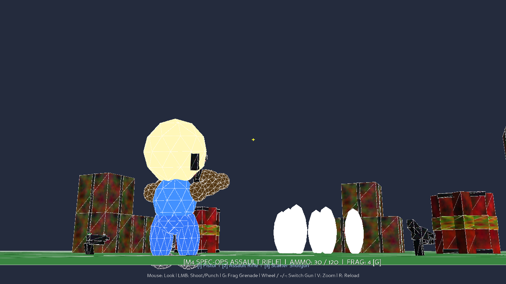
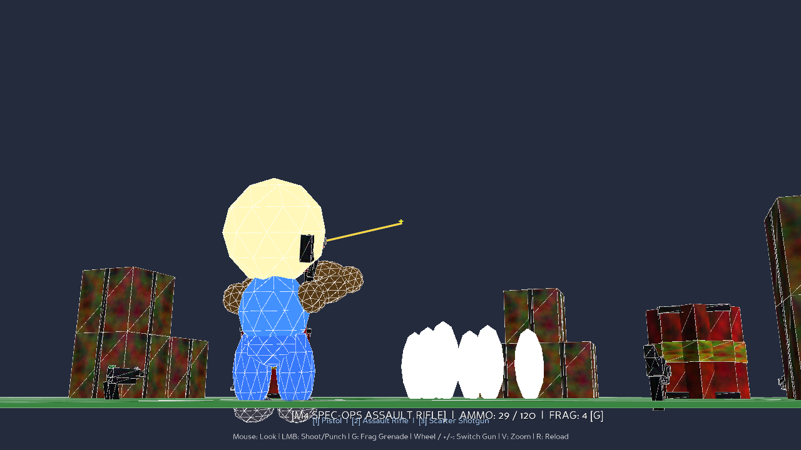
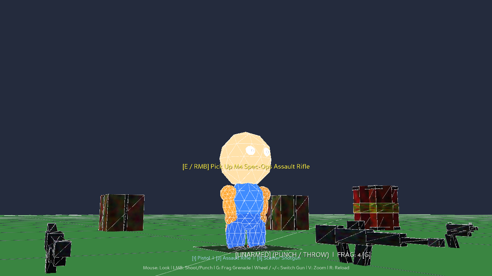

# 🧸 PuppetEngine

> A lightweight 3D procedural physics & tactical sandbox game engine built in pure Python.

<p align="center">
  
</p>

---

## 🌟 About the Project

Building a 3D game engine from scratch has been a **long-term childhood dream of mine**, and **PuppetEngine** is the result of that journey!

For character movement and biomechanics, I heavily referenced and took inspiration from **[Ballistica](https://github.com/efroemling/ballistica)** (the open-source engine behind *BombSquad*). I love how alive, expressive, and bouncy the clay-puppet characters feel in Ballistica, so I incorporated its organic spring-damper joint physics, harmonic running arm swings, dynamic footing and balance decay, and punch momentum into pure Python.

### 💡 Ultra-Lightweight with Endless Possibilities
- **Zero Asset Bloat:** The entire engine is super small (just a few hundred KB of code, practically zero MB). All 3D weapon meshes, character limbs, and arena props are generated procedurally on startup, with no massive multi-gigabyte asset downloads required!
- **Endless Possibilities:** Because the whole engine is written in clean, modular Python using Panda3D and Bullet physics, it's super easy to hack on. You can tweak spring stiffness, add new procedural weapons, create custom arenas, build minigames, or plug in your own multiplayer networking!

---

## 📸 Screenshots

| Tactical Third-Person Aiming | Kinetic Firing & Bullet Tracers |
|:---:|:---:|
|  |  |

<p align="center">
  <b>The Procedural Clay-Puppet Character</b><br>
  
</p>

---

## ✨ Features

- **Procedural Spring-Damper Physics:** Organic ragdoll-like character biomechanics inspired by Ballistica with smooth athletic arm swing, balance loss flailing, and dynamic lean.
- **Tactical Third-Person Gameplay:** Smooth over-the-shoulder free-look camera with 3 zoom presets and two-ray parallax-free crosshair aiming.
- **Weapon Arsenal & Back Holstering:**
  - `1`: Tactical Heavy Pistol
  - `2`: M4 Spec-Ops Assault Rifle
  - `3`: SPAS Combat Shotgun
  - Inactive weapons stay neatly slung across the puppet's back in tactical scabbards.
- **Tactical Ballistics & Explosives:** Bouncing frag grenades (`G`), explosive fuel hazard barrels with chain reactions, kinetic bullet ricochets, and spark showers.
- **Physics Interactions:** Lift and throw crates or bowling pins overhead, or toggle low-friction ice skating mode (`H`).
- **Blazing Fast Startup:** Boots and runs in under a second on almost any machine!

---

## 🎮 Controls

| Control | Action |
|:---|:---|
| **Mouse Move** | Free 360° Camera Look & Aim |
| **Left Click (LMB)** | Shoot Weapon / Melee Punch |
| **Right Click / E** | Pick Up Weapon / Ammo / Throw Prop |
| **G** | Throw Fragmentation Grenade |
| **1, 2, 3** | Select Weapon (Pistol, Rifle, Shotgun) |
| **Mouse Scroll / `+` / `-`** | Cycle Inventory Weapons |
| **R** | Reload Active Weapon |
| **WASD / Arrows** | Run & Tactical Strafe |
| **Shift** | Sprint Boost |
| **Space** | Jump / Mid-air bicycle kick |
| **V** | Cycle Camera Zoom (Close, Normal, Wide) |
| **H** | Toggle Ice Mode (Low Friction Skating) |
| **Tab** | Toggle Mouse Cursor Lock |
| **Esc** | Exit Game |

---

## 🚀 Getting Started

### 1. Requirements
- Python 3.10+
- Panda3D:
```bash
pip install panda3d
```

### 2. Run the Engine
Clone the repository and launch the sandbox:
```bash
git clone https://github.com/arjncx-lang/puppet-engine.git
cd puppet-engine
python main.py
```
*On Windows, you can also simply double-click `run.bat`!*

---

## 📁 Project Structure

```
puppet-engine/
├── character.py          # Puppet character kinematics, spring-dampers & inventory
├── items.py              # Weapons, ammo, and pickups
├── props.py              # Procedural 3D weapon meshes, crates & hazard barrels
├── physics_math.py       # Ballistica-inspired math, spring dampers & IK solvers
├── physics_constants.py  # World physics tuning & balance limits
├── main.py               # Main engine loop, TPS camera & rendering
├── assets/               # Screenshots and visual media
├── sfx/                  # Sound effects (gunshots, punches, explosions)
├── run.bat               # Windows one-click launcher
└── README.md
```

---

## 📜 License

This project is licensed under the [MIT License](LICENSE). Feel free to learn from it, build on top of it, or use it in your own creative projects!
